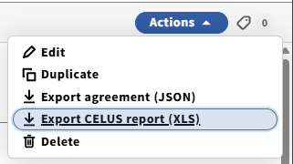
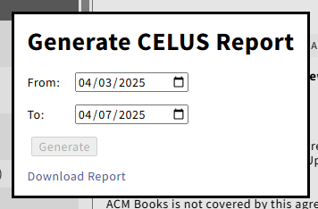

# FOLIO CELUS Report Link

When viewing an agreement in FOLIO, this tool adds a menu item that 
  * prompts the user for a date range, and then
  * generates and returns a link to the CELUS report.

  

  

## Architecture

* A python microservice takes the report ID and date range, calls the CELUS API and returns the report link.
* A TamperMonkey script integrates the menu item into the FOLIO UI.

## Report Preparation

A base report for each agreement must be configured first in CELUS and linked in the agreement record.

### FOLIO Setup

In Settings > Agreements > Supplementary Properties, create a new property:
- Name: CELUS Report ID
- Category: "Usage Reporting"
    - This text actually matters; configure if needed in the TamperMonkey script.

### For Each Agreement

* The electronic resources librarian creates a CELUS report for each (needed) FOLIO agreement.
* ERL stores the CELUS "report ID" in a supplementary property field of the agreement.

## Server Configuration and Deployment

1. Create and configure `config.properties` based on [the example](./config/config.properties.example).
1. Clone this repo.
1. Start docker.

```
git clone https://github.com/lehigh-university-libraries/folio-celus-report-link
cd folio-celus-report-link
# cp config/config.properties.example config/config.properties
# make edits to config/config.properties
docker run \
  -v ./:/app
  -p 8080:8080 \
  --rm \
  --name folio-celus-report-link \
  ghcr.io/lehigh-university-libraries/folio-celus-report-link:main
```

## Script Configuration and Hosting

As a security measure, the TamperMonkey script requires an edit to allow connections to the institutional domain where you have deployed the server component, instead of Lehigh.

```
// @connect      lehigh.edu
```

One approach is just to fork this repo on GitHub, and edit the script in your fork.  Users can then install the script by loading the raw version of that file directly from GitHub, as in the example below.

## Script Installation (for each user)

1. Install the Tampermonkey extension to your browser, i.e. [for Chrome](https://chromewebstore.google.com/detail/tampermonkey/dhdgffkkebhmkfjojejmpbldmpobfkfo?hl=en).
1. Enable Chrome extensions "Developer Mode".
1. Enable the extension to "Allow User Scripts".  In Chrome, open the Extensions Manager (chrome://extensions/), find Tampermonkey, then Details > Allow User Scripts.
1. Install the FOLIO Celus Report Link user script by opening this URL: https://github.com/YOUR_GITHUB_ORG_WHERE_YOU_FORKED_THIS_REPO/lehigh-university-libraries/folio-celus-report-link/raw/refs/heads/main/application/static/folio_celus_report_link.user.js
    1. Note that you will need to change the URL to reflect where you are hosting the script.

Configure within FOLIO

After Data Preparation above.

1. Open any agreement record.  The first time, you will be prompted to enter a server base URL where the web service portion of this integration is deployed. 
